## Welcome to the page for the Statistical Inference Project

You can view the [Dataset](https://github.com/razcona/Statistical-Inference-Project/tree/master/Data) CSV files for the project in the Data folder.


### Google Play Store App Dataset

The Dataset that I have chosen to perform a statistical analysis for the project is one that contains details on a long list of Apps that are uploaded on the Android market's Google Play Store. There are 13 features that describe a given app.
```markdown

### The features/columns are as follows:

-App: Application name
-Category: Category the app belongs to
-Rating: Overall user rating of the app (as when scraped)
-Reviews: Number of user reviews for the app (as when scraped)
-Size: Size of the app (as when scraped)
-Installs: Number of user downloads/installs for the app (as when scraped)
-Type: Paid or Free
-Price: Price of the app (as when scraped)
-Content: RatingAge group the app is targeted at - Children / Mature 21+ / Adult
-Genres: An app can belong to multiple genres (apart from its main category). For eg, a musical family game will belong to Music, Game, Family genres.
-Last Updated: Date when the app was last updated on Play Store (as when scraped)
-Current Ver: Current version of the app available on Play Store (as when scraped)
-Android Ver: Min required Android version (as when scraped)


```

For more details and the source of the Dataset visit [Kaggle's Google PlayStore Dataset](https://www.kaggle.com/lava18/google-play-store-apps/home).

### Possible predictions and analysis.

With this Dataset, I hope to answer questions such as how to increase the likelyhood of having a successful app on the Google Play Store. Questions such as would uploading my app for free or for a fee(paid) factor in reaching a wider audience or user base. Also, is success predicated on how good the ratings are for the application and would a higher raiting also mean a larger amount of downloads or installs. Lastly, does the content and genre play a huge factor in the success of the Apps.

## Update - Project Milestone 3
### Mean and Standard Deviation

Before I was able to compute simple statistical calculations such as the mean and the standard deviation, I first had to modify the googleplaystore.csv file because two of the 3 numeric columns, the Installs and Price columns were not in numeric format. The Price column was in a currency format which had a '$' character on every price greater than 0. To fix that was simple enough as selecting the entire column and changing the format from currency to numeric. The Installs column however, was a little more complicated. Every entry in the Installs attribute had the number and a '+' sign concatenated at the end of each number denoting an approximation of the number of installs and possibly exceeding that number. In order to fix that I had to use a excel function that allowed me to trim the last character and drag down the function to the rest of the column. This was not the complete solution to the problem. When importing the csv file, R was reading the Installs attribute as Strings, so I had to parse it and convert them into numeric values in R. I was then able to compute the mean and standard deviation. I chose the two mentioned columns of Price and Installs, as well as Rating which are 3 numeric columns in the google play store dataset. The Mean and Standard deviation for each attribute are as follows:

Price Column
- Mean = 1.027368
- SD   = 15.9497

Rating Column
- Mean = 4.193338
- SD   = 0.5374313

Installs Column
- Mean = 15465766
- SD   = 85033154

The updated googleplaystore.csv file and the r file where the code for the calculations are stored can be found in the [data folder](https://github.com/razcona/Statistical-Inference-Project/tree/master/Data) of this project. 

## Update - Project Milestone 4
### Initial Plots for Numerical Data Columns

### App Installs:

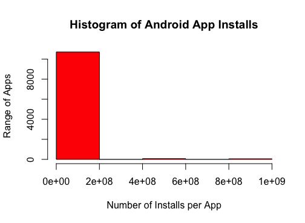

For the Installs column, the above Histogram shows that most of the Apps in the playstore fall between 0 installations - 2 X 10^8 installations. If you carefully observe on the 4 X 10^8 - 6 X 10^8 range and the 8 X 10^8 - 1 X 10^9 range, there is a small histogram noting outliers existing in those ranges. 

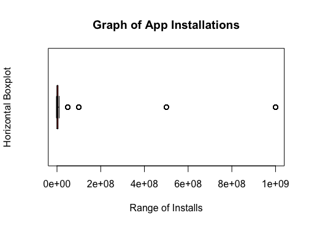

The above Boxplot shows a stark visualization of the extreme observations represented by the circles outside of the boxplot main structure. Sans the outliers, the range of the App installations are extremely similar that it is difficult to see the boxplot structure properly. The lower and upper hinges aren't clear enough apart that you cannot point out where anything else in between it is such as the median, lower and upper quartile, nor te whiskers.

### App Price:

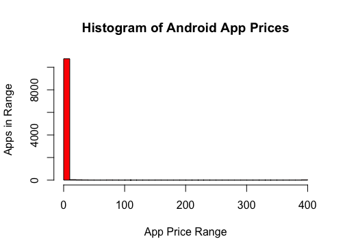

The above Histogram shows how the most of Apps in the Google Play Store are free versus the few that have a cost. The longest rectangle in the histogram is closer to 0 showing just that. In this graph however, you can barely see the outliers but with the boxplot they are much clearer. 

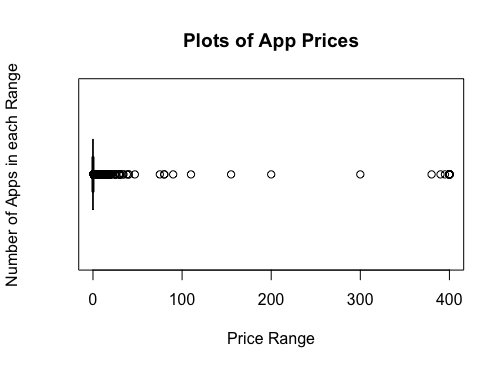

As represented in this Boxplot there are alot more outliers in this one compared to the installs but the main boxplot structure is even more unrecognizable due to the sheer amount of free apps in the store. 

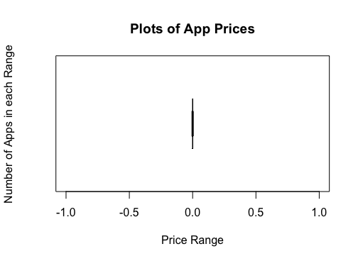

This Boxplot is the same Prices column but with the outliers trimmed so it can be easier to see how close to 0 the observations are further showing that most Apps are free.

### App Ratings:

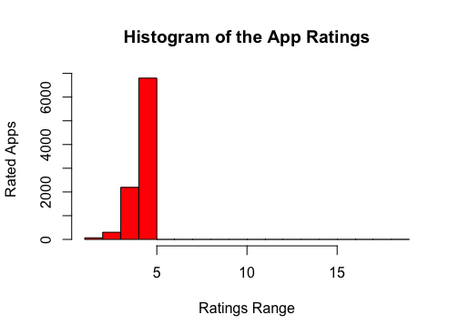

this Histogram represents the User Ratings of each App in the Google Play Store. The ratings range is from 1-5 stars which can be seen in the graph since all of the rectangles are to the left of 5 and somewhat peaking close to 5. The histogram however doesn't give you a more clearer range of where they mostly lie. The Boxplot does show you a better visualiztion.

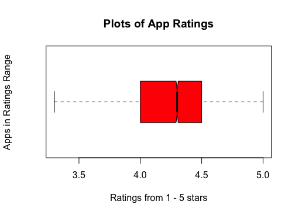

With this graph the range is clearer. The Boxplot shows the range lies between 4 - 4.5 stars. This is further proven by taking the mean that was previously calculated which is 4.19. This boxplot compared to the ones for Installs and Prices, has a much larger spread which is visually identifiable by the shape of the boxplot. 

## Update - Project Milestone 5
### Pareto Charts and Analysis for Qualitative Features.
The 3 columns that I chose to look at through a pareto chart are Category, Content Rating, and Type. 

### Category
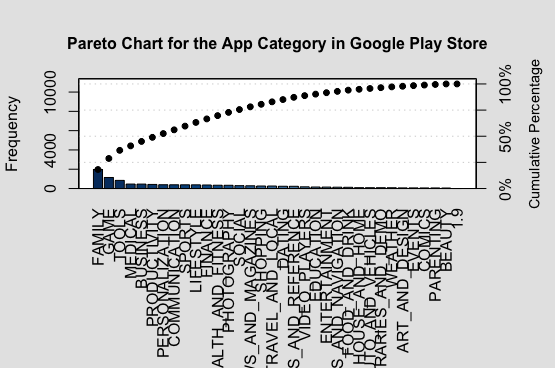

In this chart, you can clearly see the 3 main app categories with the most frequency in the Google Play Store which are 'Family,' 'Game,' and 'Tools.' Their respective percentages are 18.19%, 10.55%, and 7.77%. After 'Tools', the next category drops down to 4.27%, which then gradully drops until the lowest percentage which is a fraction of 1%. Applying the Pareto principle of the "Vital Few", the net casted by the principle in this case is larger than usual since the cut off for the vital few would be any category to the left of the Shopping category since that is where the line from 80% of the cum. percentages touches the curve vertically. That is almost half of all of the categories listed.

### Content Rating
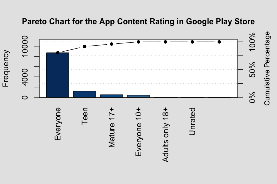

In this chart, the most frequent content Rating of 'Everyone' is also the sole rating in the "Vital Few" boundary since it is 80% of all Apps of this rating. The remaining 20% is split among the other 5 ratings with the next largest being rated 'Teen' with a percentage of 11.14%. 

### Type
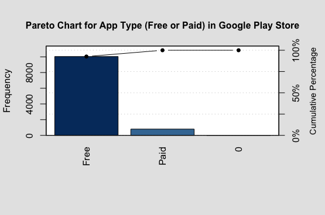

Type describes whether its a free or paid app. since there is only 2 and the majority of the apps in the playstore are free (10,039 free apps), The pareto chart isn't necessary to interpret this data. 

## Update - Project Milestone 6
### Confidence Intervals of the Numerical Data

In this section of the project, I have computed the confidence intervals of the numerical columns: Price, Ratings and Installs. The confidence interval is computed using the formula mu_hat +/- zα/2 * sigma/sqrt(n). All calculations can be viewed in the R file of milestone 6. For all 3 confidence intervals I chose a 95% confidence level, therefore my alpha = 0.05. 

### Confidence Intervals
Price: 
95% confidence interval is {0.73, 1.33}

Rating:
95% confidence interval is {4.18, 4.20}

Installs:
95% confidence interval is {13864917, 17066614}

## Update - Project Milestone 7
### Hypothesis Tests

There are 3 Hypothesis tests that I decided to perform on the Google Play Store dataset using a 95% confidence level, therefore my alpha will be α = 0.05.

### First Hypothesis

In the first test I wanted to see whether the Game Apps are less popular than the Communication Apps (WeChat, WhatsApp Messenger, Gmail etc...) using the number of Installs as the metric of popularity. In order to do this, I took a subset of the dataset with only Game Apps and another subset with only Communication Apps and then performed a one-sided student t-test where the alternative hypothesis is x-y < 0 where x is the mean of the Game Apps and y the mean of the communication apps which if successful, you can reject the null hypothesis, and conclude that Game Apps are less popular than Communication Apps in the Google Play Store.

The following R code performs the t-test explained above:

gameApps <- subset(final_data, Category == "GAME")
communicationApps <- subset(final_data, Category == "COMMUNICATION")
t.test(gameApps$Installs, communicationApps$Installs, alternative = "less")

Which Produced the following results: 

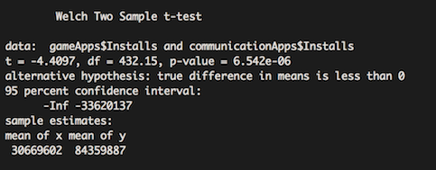
 
As seen above, the p-value < alpha so we can reject the null hypothesis and conclude with 95% confidence that Game Apps are less popular than Communication Apps. 
 
### Second Hypothesis
 
In the second test I decided to conduct the same test for two other categories; Social Apps (instagram, facebook, twitter, etc...) and Dating Apps. The following R code was the first test performed: 
 
datingApps <- subset(final_data, Category == "DATING")
socialApps <- subset(final_data, Category == "SOCIAL")
t.test(socialApps$Installs, datingApps$Installs, alternative = "less")

which produced the following results: 

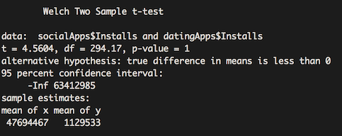

As seen from the results, the p-value of 1 is greater than the alpha 0.05 so we fail to reject the null hypothesis of x-y = 0, but from the mean of x and y we can infer that there is a difference and since x (social apps) has a significantly larger mean than y (dating apps) the assumption that social media apps were less popular than dating apps, so to confirm that social media apps are more popular, we perform the same test but change the one-sided test to x-y > 0 with the following R code:

t.test(socialApps$Installs, datingApps$Installs, alternative = "greater")

which produced the following result:

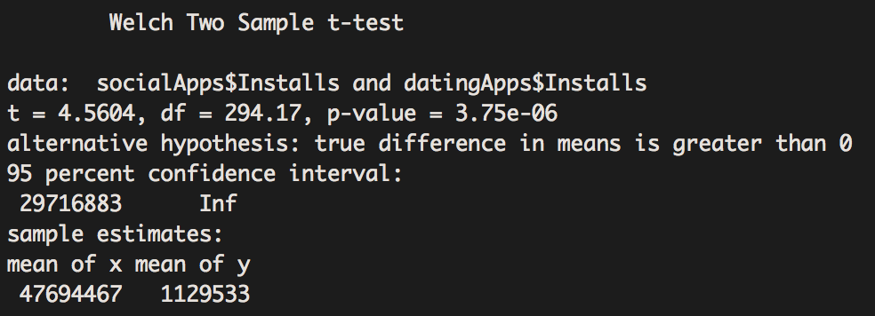

In this test the p-value is smaller than the alpha, therefore, we can reject the null hypothesis and conclude that social Apps are more popular than Dating Apps with 95% confidence. 

### Third Hypothesis

In the third test, I wanted to confirm my assumption that Game Apps are on average more expensive than Communication Apps. Therefore I first conducted Right-sided t-test using the average price of Game Apps as x and the average price of Communication Apps as y, with the following code:

t.test(gameApps$Price, communicationApps$Price, alternative = "greater")

which produces the following results:

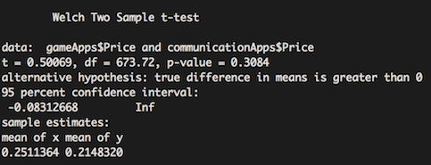

The p-value is greater than the alpha so we fail to reject the null hypothesis. Since the difference in mean of x and y is a small fraction, it does not provide sufficient evidence to conclusively assert that there is a difference in price between the two categories of apps whether we perform the one-sided test x-y >0 as shown above,

or the other one-sided test x-y < 0 

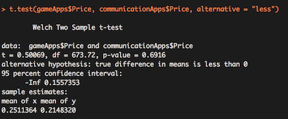

or the two-sided x-y != 0. 

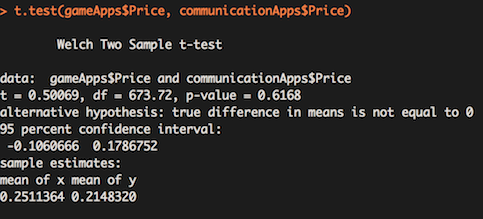

## Update - Milestone 8
### Linear Regression Analysis 

I wanted to test whether the Number of installs had any indication on the rating the app recieves by the user and if it is linearly correlated. To do this I computed a regression model and plotted the points with a regression line:

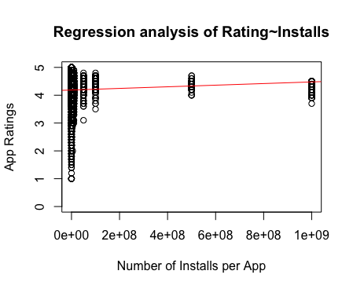

Looking at the plot, the App Installs and the App Ratings are not linearly correlated. It is logical since a hight number of installs does not directly mean it has a 5 star rating. The level of satisfaction each user has for the App is solely contingent upon the App functionality/quality itself and not the amount of installs. To confirm that the model isn't a good fit for a linear regression analysis, I plotted a histogram using the residuals of the model:

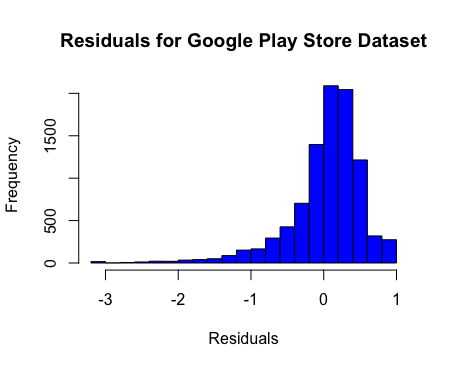

As seen, although it does have a semblance of a normally distributed histogram, it is heavily skewed to the left which can indicate a bad fit. 
