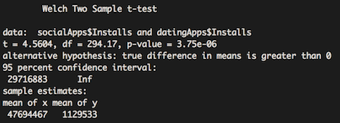

# Statistical Inference Project

You can view the [Dataset](https://github.com/razcona/Statistical-Inference-Project/tree/master/Data) CSV files for the project in the **Data** folder.

## Google Play Store App Dataset

The dataset I selected contains information on a large collection of apps published on the Google Play Store. It includes **13 features** that describe each app.

### Features / Columns

- **App:** Application name  
- **Category:** Category the app belongs to  
- **Rating:** Overall user rating (at time of scraping)  
- **Reviews:** Number of user reviews  
- **Size:** Application size  
- **Installs:** Number of user downloads/installs  
- **Type:** Paid or Free  
- **Price:** Price of the app  
- **Content Rating:** Target age group (e.g., Everyone, Teen, Mature 21+)  
- **Genres:** Additional genres (e.g., a family music game may be in Music, Game, Family)  
- **Last Updated:** Date of the most recent update  
- **Current Ver:** Current version of the app  
- **Android Ver:** Minimum required Android version  

For more details, see the original dataset on Kaggle.
[Kaggle's Google PlayStore Dataset](https://www.kaggle.com/lava18/google-play-store-apps/home).

---

## Initial Analysis and Research Questions

With this dataset, I aimed to explore questions related to app success, such as:

- Does offering an app for free increase its reach?  
- Are higher user ratings associated with higher install counts?  
- Do certain genres or content ratings correlate with app popularity?  
- What factors contribute most to an app’s performance on the Play Store?

---

## Update — Project Milestone 3
### Mean and Standard Deviation

Before calculating summary statistics, I had to clean the dataset:

- **Price:** The “$” symbol had to be removed to convert the column to numeric.  
- **Installs:** Each value contained a “+” symbol. I removed it using an Excel function and later converted the column to numeric in R.

I then computed the mean and standard deviation for the three numerical columns: **Price, Rating, and Installs.**

**Price**  
- Mean = 1.027368  
- SD = 15.9497  

**Rating**  
- Mean = 4.193338  
- SD = 0.5374313  

**Installs**  
- Mean = 15,465,766  
- SD = 85,033,154  

The updated googleplaystore.csv file and the r file where the code for the calculations are stored can be found in the [data folder](https://github.com/razcona/Statistical-Inference-Project/tree/master/Data) of this project. 

---

## Update — Project Milestone 4
### Initial Plots for Numerical Data

#### App Installs

For the Installs column, the above histogram shows that most of the apps in the Play Store fall between 0 and 2 x 10⁸ installations. If you observe the 4 x 10⁸ – 6 x 10⁸ range and the 8 x 10⁸ – 1 x 10⁹ range carefully, you'll note small bars indicating existing outliers. 

The above Boxplot shows a stark visualization of the extreme observations represented by the circles outside of the boxplot's main structure. Without the outliers, the range of the app installations is so extremely similar that it is difficult to see the boxplot structure properly. The lower and upper hinges aren't far enough apart that you cannot point out anything else in between them, such as the median, lower and upper quartiles, nor the whiskers.

#### App Price:

The histogram above shows how most of the apps in the Google Play Store are free versus the few that have a cost. The longest rectangle in the histogram is closer to 0, which illustrates just that. In this graph, however, you can barely see the outliers, but with the box plot, they are much clearer. 

As represented in this boxplot, there are far more outliers in this one compared to the installs, but the main boxplot structure is even more unrecognizable due to the sheer volume of free apps in the store. 

This box plot uses the same 'Prices' column, but the outliers have been trimmed so that it can be easier to see how close to 0 the observations are, further showing that most apps are free.

#### App Ratings:

This histogram displays the user ratings for each app in the Google Play Store. The ratings range is from 1 to 5 stars, evident in the graph, as all bars are situated to the left of 5 and appear to peak near that value. The histogram, however, does not provide a precise range of where the majority of ratings lie. The box plot offers a superior visualization.

With this graph the range is clearer. The Boxplot shows the range lies between 4 and 4.5 stars. This is further proven by taking the mean that was previously calculated which is 4.19. This boxplot compared to the ones for Installs and Prices, has a much larger spread which is visually identifiable by the shape of the boxplot. 

## Update - Project Milestone 5
### Pareto Charts and Analysis for Qualitative Features.

#### Category

In this chart, you can clearly see the 3 main app categories with the most frequency in the Google Play Store which are 'Family,' 'Game,' and 'Tools.' Their respective percentages are 18.19%, 10.55%, and 7.77%. After 'Tools', the next category drops down to 4.27%, which then gradully drops until the lowest percentage which is a fraction of 1%. Applying the Pareto principle of the "Vital Few", the net casted by the principle in this case is larger than usual since the cut off for the vital few would be any category to the left of the Shopping category since that is where the line from 80% of the cum. percentages touches the curve vertically. That is almost half of all of the categories listed.

#### Content Rating

In this chart, the most frequent content Rating of 'Everyone' is also the sole rating in the "Vital Few" boundary since it is 80% of all Apps of this rating. The remaining 20% is split among the other 5 ratings with the next largest being rated 'Teen' with a percentage of 11.14%. 

#### Type

Type describes whether it's a free or paid app. Since there are only two categories and the majority of the apps in the Play Store are free (10,039 free apps), a Pareto chart isn't necessary to interpret this data. 

## Update - Project Milestone 6
### Confidence Intervals of the Numerical Data

In this section of the project, I have computed the confidence intervals of the numerical columns: Price, Ratings and Installs. The confidence interval is computed using the formula mu_hat +/- zα/2 * sigma/sqrt(n). All calculations can be viewed in the R file of milestone 6. For all 3 confidence intervals I chose a 95% confidence level, therefore my alpha = 0.05. 

### Confidence Intervals
**Price:** 
95% confidence interval is {0.73, 1.33}

**Rating:**
95% confidence interval is {4.18, 4.20}

**Installs:**
95% confidence interval is {13,864,917, 17,066,614}

## Update - Project Milestone 7
### Hypothesis Tests

There are 3 Hypothesis tests that I decided to perform on the Google Play Store dataset using a 95% confidence level, therefore my alpha will be α = 0.05.

### First Hypothesis

In the first test, I wanted to see whether the game apps are less popular than the communication apps (WeChat, WhatsApp Messenger, Gmail, etc.) using the number of installs as the metric of popularity. In order to do this, I took a subset of the dataset with only game apps and another subset with only communication apps, and then performed a one-sided Student's t-test where the alternative hypothesis is \(x-y<0\), where \(x\) is the mean of the game apps and \(y\) the mean of the communication apps which, if successful, would allow you to reject the null hypothesis and conclude that game apps are less popular than communication apps in the Google Play Store. 

The following R code performs the t-test explained above:

gameApps <- subset(final_data, Category == "GAME")
communicationApps <- subset(final_data, Category == "COMMUNICATION")
t.test(gameApps$Installs, communicationApps$Installs, alternative = "less")

Which Produced the following results: 

 
As seen above, the p-value < alpha so we can reject the null hypothesis and conclude with 95% confidence that Game Apps are less popular than Communication Apps. 
 
### Second Hypothesis
 
In the second test I decided to conduct the same test for two other categories; Social Apps (Instagram, Facebook, Twitter, etc...) and Dating Apps. The following R code was the first test performed: 
 
datingApps <- subset(final_data, Category == "DATING")
socialApps <- subset(final_data, Category == "SOCIAL")
t.test(socialApps$Installs, datingApps$Installs, alternative = "less")

which produced the following results: 

As seen from the results, the p-value of 1 is greater than the alpha 0.05, so we fail to reject the null hypothesis of x-y = 0. However, from the means of x and y we can infer that there is a difference, and since x (social apps) has a significantly larger mean than y (dating apps), the assumption that social media apps were less popular than dating apps [is incorrect]. To confirm that social media apps are more popular, we perform the same test but change the one-sided test to x-y > 0 with the following R code:

t.test(socialApps$Installs, datingApps$Installs, alternative = "greater")

which produced the following result:

In this test the p-value is smaller than the alpha, therefore, we can reject the null hypothesis and conclude that social Apps are more popular than Dating Apps with 95% confidence. 

### Third Hypothesis

In the third test, I wanted to confirm my assumption that Game Apps are on average more expensive than Communication Apps. Therefore I first conducted Right-sided t-test using the average price of Game Apps as x and the average price of Communication Apps as y, with the following code:

t.test(gameApps$Price, communicationApps$Price, alternative = "greater")

which produces the following results:

The p-value is greater than the alpha, so we fail to reject the null hypothesis. Since the difference in the mean of x and y is a small fraction, it does not provide sufficient evidence to conclusively assert a difference in price between the two categories of apps. This conclusion holds whether we perform the one-sided test (x - y > 0) as shown above,

the other one-sided test x-y < 0 

or the two-sided x-y != 0. 

## Update - Milestone 8
### Linear Regression Analysis 

I wanted to test whether the Number of installs had any indication on the rating the app recieves by the user and if it is linearly correlated. To do this I computed a regression model and plotted the points with a regression line:

Looking at the plot, the App Installs and the App Ratings are not linearly correlated. This is logical since a high number of installs does not directly mean that it will have a close to 5-star rating. The level of satisfaction each user has for the app is solely contingent upon the app's functionality/quality itself and not the amount of installs. However, there is a small trend in that a higher number of installs results in a higher rating, but based solely on the linear regression model, we do not have sufficient information to make that determination. To confirm that the model is not a good fit for a linear regression analysis, I plotted a histogram using the residuals of the model:

As seen, although it does have a semblance of a normally distributed histogram, it is heavily skewed to the left which can indicate a bad fit. 

## Update - Final Milestone
### ANOVA and Chi-Squared - Goodness of Fit

For the ANOVA (Analysis of Variance) test, I decided to look at only game Apps in the Play Store.
First, the mean Rating is 4.19, with not much variance when looked at graphically. The Content.Rating feature shows the age rating of each app, which are: Everyone, Everyone 10+, Mature 17+, and Teen. In R, I performed an ANOVA test using the Rating~Content.Rating features of game-only apps. By default, the ANOVA test sets the null hypothesis as the Rating means of each Content.Rating group being equal, and the alternate hypothesis being that at least one group mean is different than the other group means.

As seen in the ANOVA table above, the p-value (0.222) is greater than any standard alpha level (0.1, 0.05, or 0.01). Therefore, we fail to reject the null hypothesis because there is no significant difference in the means.

As seen in the mean table above, each group mean as well as the grand mean are different by a fraction. 

In the post-hoc analysis, you can see that not one Content.Rating pair has a difference that makes a p-value smaller than 0.10**,** making it difficult to conclude that there is a significant difference in Ratings between games targeted at different age groups.
For the Chi-Squared Test**,** I look at the type feature that lists whether the app is paid or free versus the Genre of the game apps. There are 24 genres of game apps, and each one is either a paid app or a free app. After creating a contingency table with the formula Freq ~ Type + Genres, I then performed the Chisq.test() and got the following results:

As seen above, the p-value of 0.0002998 is less than an alpha of 0.01 so we can reject the null hypothesis that Type and Genres are independent of each other and conclude with 99% confidence that Type and Genres are correlated.
